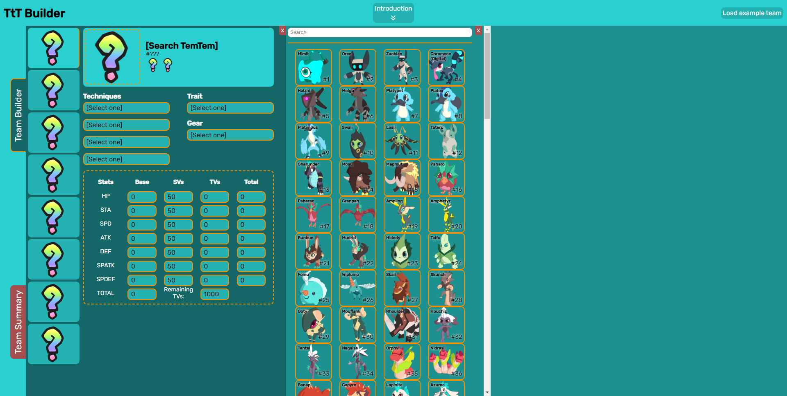
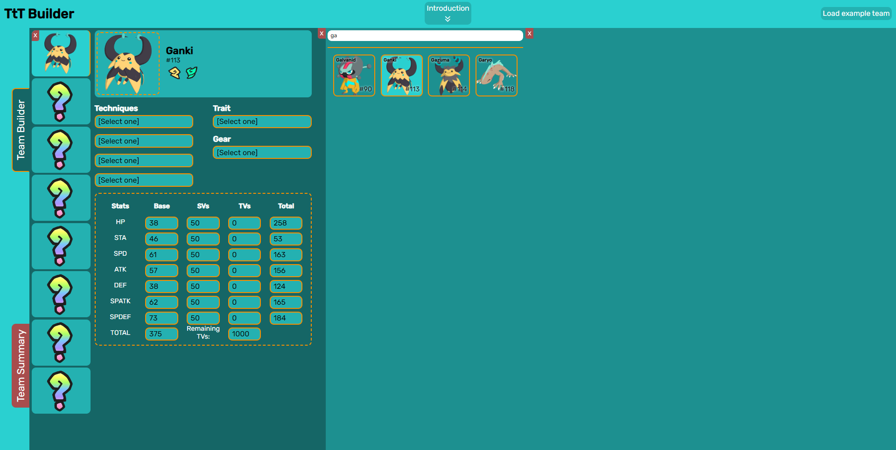
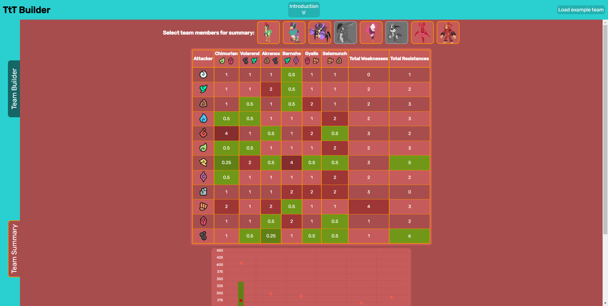

> Este proyecto es una refactorización de TemTeam (https://github.com/Lucas-GomezP/TemTeam), el proyecto final de FDW. Se tomó la decisión de refactorizarlo porque el proyecto original fue una excelente práctica para entender todos los conceptos relacionados con APIs y el manejo del DOM. Sin embargo, a pesar de estar muy avanzado, presentaba problemas de lentitud y el código era complejo de leer y mantener.

# TtT Builder: Constructor de equipos de TemTem

TemTeam es un constructor de equipos para el videojuego llamado TemTem, el cual consiste en la formación de un equipo de 6 criaturas que combatan entre sí en batallas 2vs2 por turnos. Pero, ¿qué es TemTem?

Según sus creadores, TemTem es:

> Temtem es una aventura multijugador masiva de colección de criaturas. Busca aventuras en el encantador Archipiélago Aéreo junto a tu equipo de Temtem. Captura todos los Temtem, lucha contra otros entrenadores, personaliza tu casa, únete a la aventura de un amigo o explora el dinámico mundo en línea.

En otras palabras, TemTem es un juego multijugador donde se capturan criaturas al estilo Pokémon, pero con un factor multijugador más activo. Estas criaturas cuentan con 7 estadísticas individuales cada una, puntos base particulares para cada una, dos tipos de puntos extra para cada una de estas estadísticas que afectan al resultado final, cuatro posibles ataques independientes para cada criatura que se eligen de una lista determinada, naturalezas que afectan a estas habilidades y la posibilidad de llevar consigo un objeto que también modifica estas últimas. A su vez, cada TemTem puede contar con 1 o 2 tipos asi como cada ataque tiene un tipo, estos tipos tienen debilidades y eficiencias dependiendo de una tabla de tipos, entre un total de 12 tipos distintos.
Todo lo mencionado anteriormente varía entre cada criatura, y hay un total de 164 TemTems diferentes. Las matemáticas necesarias para crear un equipo de 8 TemTems competitivo, de los cuales en el combate participan 5 a nivel 100, y los factores que se deben tener en cuenta se vuelven complejos en esta magnitud.
Por eso, como jugador activo y experimentado de TemTem y que a su vez participo en el ranking competitivo del mismo, siempre quise facilitar esta tarea de creacion de un equipo.

## API
Para la ejecucion de este proyecto se usara la API oficial de la wiki de TemTem:
https://temtem-api.mael.tech

## Aclaracion sobre el objetivo del proyecto y uso de los datos
No se pretende crear una wiki del juego sino brindar a los usuarios que participan en rankeds (combates entre jugadores para conseguir puntos y colocarse en la tabla de mejores jugadores) una herramienta para formar de manera mas sencilla y visual sus equipos. Por este motivo se obviara mucha informacion inutil para este objetivo, como donde obtener cada TemTem, su altura o peso, su descripcion dentro del juego, etc. ya que estos al ser datos mas "esteticos" no son de interes para los jugadores competitivos.

## Elección de idioma
El proyecto se realizará íntegramente en inglés por una cuestión de congruencia con los datos de la API, ya que todos ellos están en inglés.

## Descripción del proyecto
TtT Builder consta de dos secciones principales:
* Team Builder: Esta sección será donde se llevará a cabo la construcción del equipo en sí, con todos sus atributos pertinentes.
* Team Summary: En esta sección, el usuario podrá mostrar un resumen del equipo creado, permitiendo eliminar integrantes del resumen para obtener información más específica de una composición determinada.

### Team Builder
La sección de Team Builder consta de 8 espacios (slots), uno para cada integrante del equipo. La información de los mismos se irá autocompletando a medida que el usuario seleccione dichos datos. En primer lugar, se selecciona un slot y esto abrirá la sección del editor de ese slot en particular. Dentro de este editor, se podrá seleccionar, en primer lugar, el TemTem deseado, lo que determinará la información propia del mismo y habilitará los otros campos para poder actualizar esa información. Luego de seleccionar al TemTem, se podrán escoger sus ataques, su trait y su gear, así como colocar los puntos de TV deseado. Toda la sección de búsqueda es manejada con un buscador principal, cuya información se obtiene de la API; además, esta información se puede filtrar gracias al ingreso de texto en el buscador.

### Team Summary
La sección de Team Summary se habilita una vez que el equipo está completo con 8 TemTems. Desde la parte superior, se pueden seleccionar cuáles integrantes del equipo serán tomados para el resumen, ya que en las partidas reales no jugamos con los 8 integrantes, sino solo con 5. Por lo tanto, esta función es muy útil para ver qué composiciones son más débiles y cuáles son más fuertes, y cómo se pueden mejorar. En este apartado, podemos ver una tabla de tipos para las debilidades y fortalezas de nuestros miembros, así como las totales de todo el equipo para cada elemento atacante. Luego, se puede observar un gráfico que muestra el valor promedio de cada stat, así como el valor más alto y más bajo; esto es muy útil para identificar en qué aspectos se necesita reforzar para centrar mejor los puntos de TV del equipo.

## Aclaraciones finales
Se presentan dos situaciones que impiden que el proyecto pueda finalizarse completamente como se deseó desde un principio, hasta el momento.
En primer lugar, la API aún no tiene todos los datos, ya que sigue en desarrollo. Por ejemplo, no se cuenta con la descripción de los gear, ya que la API no los contiene. Por ello, se optó por poner un enlace directo a la wiki de dicho gear.
En segunda instancia, la determinación de la consigna del proyecto de no usar gestores de paquetes, ha limitado un poco la librería escogida para los gráficos, debido a que se usa como CDN.

# Como usar TtT Builder
TtT Builder es un sistema diseñado para crear equipos de TemTem enfocados en el competitivo, facilitando tanto la creación como el análisis del equipo.

Para comenzar, observaremos 8 espacios (slots), cada uno correspondiente a un integrante del equipo, que se encuentran vacíos para que puedas armar el equipo a tu gusto.

Al seleccionar uno de estos slots, se abrirá el editor correspondiente, donde podemos elegir nuestro TemTem para ese espacio del equipo. Solo tienes que hacer clic sobre el área superior de esta sección.

Al hacer clic en esa área, se abrirá el buscador de TemTems, donde debemos elegir el que deseamos integrar a nuestro equipo.

Además, podemos filtrar por nombre para encontrarlo más fácilmente.

Al hacer clic sobre el TemTem deseado, se cargará automáticamente en el slot junto con su información pertinente.

Ahora, procedemos a rellenar los otros campos. Comencemos con los ataques. Al hacer clic en alguno de los 4 campos de "Techniques", se desplegará nuevamente el buscador con los ataques que puede tener ese TemTem. Aquí también podemos escribir para encontrar el ataque deseado más fácilmente.

Hacemos lo mismo con el Trait.

Y con el gear.

Luego, debemos configurar los TV (Training Values). Estos tienen un límite de 1000 en total y un máximo de 500 por habilidad. El sistema está preparado para controlar que esto se cumpla y actualizar automáticamente el resultado final de la estadística.

Si solo deseas probar el sistema y conocer su funcionamiento, puedes hacer clic en el botón "Load example team" ubicado en la esquina superior derecha para cargar un equipo completo con toda su información.

Una vez que tengamos nuestro equipo completo, se habilitará la sección de "Team Summary", donde podemos observar un resumen de nuestro equipo y su información. En la parte superior, podemos hacer clic sobre cada integrante para deshabilitarlos del resumen y observar mejor las fortalezas y debilidades de cada composición.

